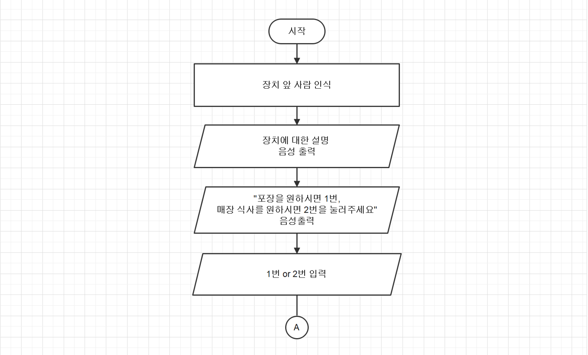
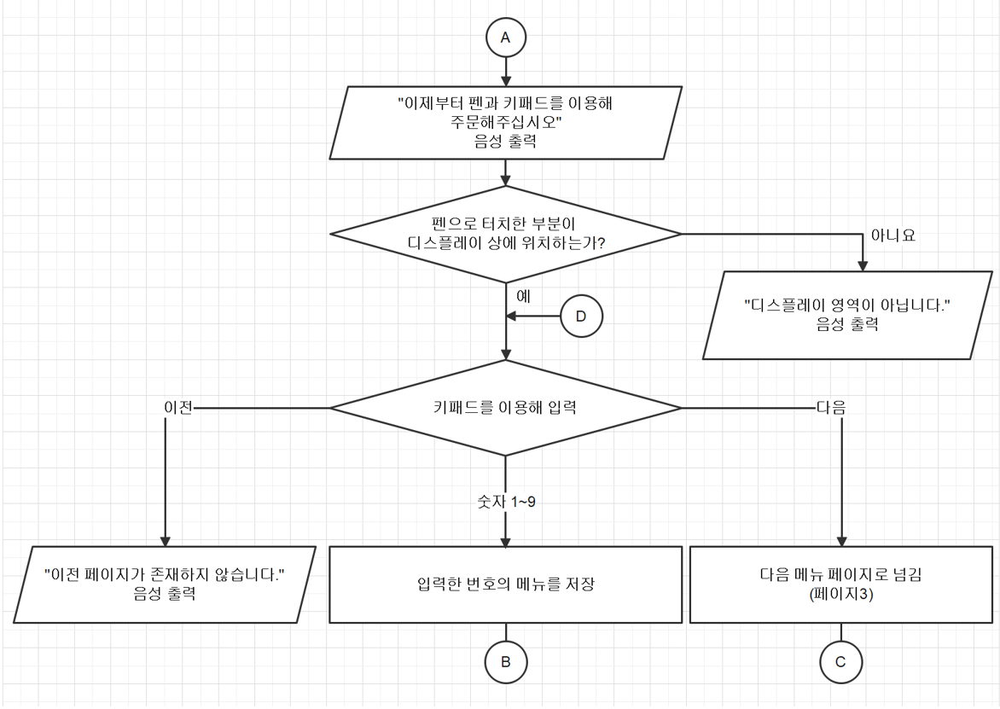
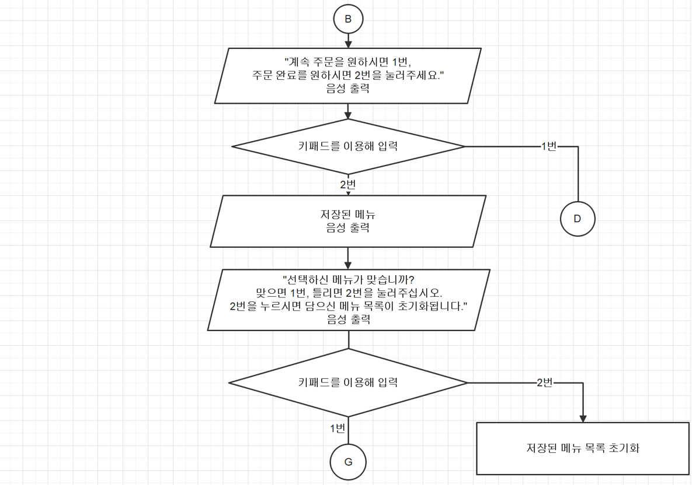
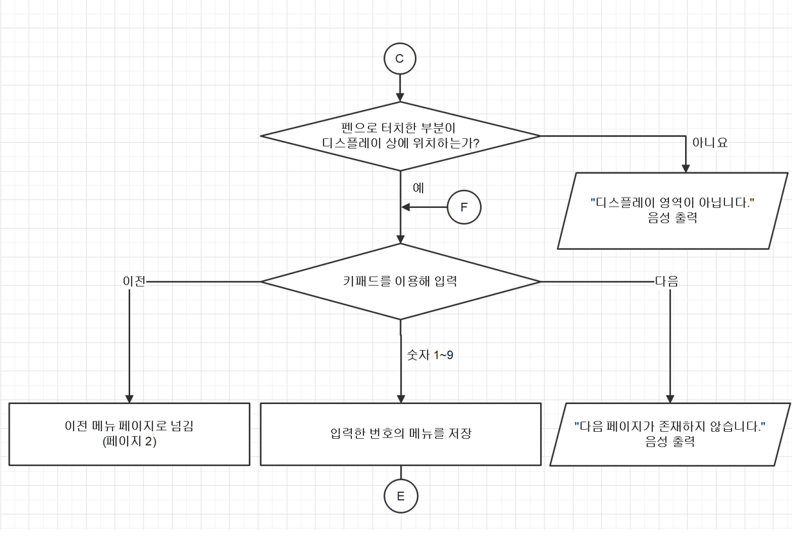
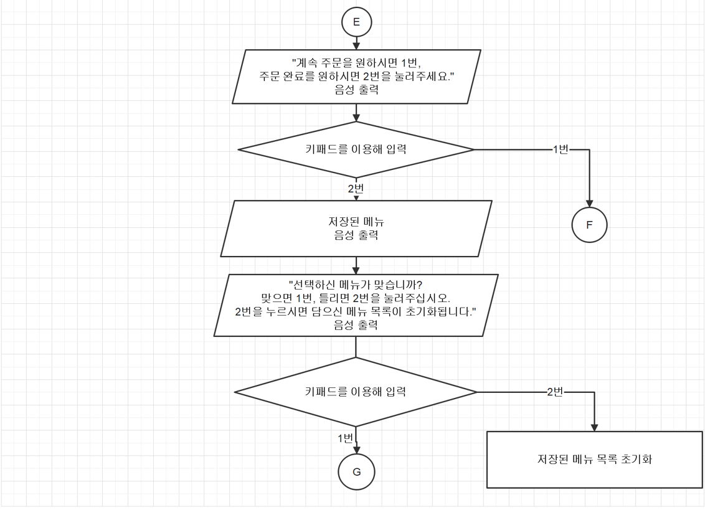
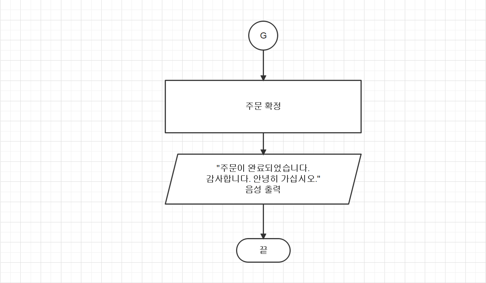

# 시각키키 (Sigakkiki)
시각장애인이 남의 도움없이 주문할 수 있는 장치

2022.10. ~ 2022.11. (FEDEC 작품전시회 창의상)

광운대학교 공학설계입문 X1조 설계과제 최종 결과물입니다. 무인 단말기 확산으로 인해 시각장애인이 겪는 정보 격차와 소외 문제를 해결하기 위해 기획되었습니다.

 

## 1. 프로젝트 배경 (Why)
* **키오스크 사용의 어려움:** 무인 단말기 확산으로 직원이 없는 매장이 늘어남에 따라, 시각장애인이 주문 과정에서 겪는 불편함이 커지고 있습니다.
* **음성 안내 중심 설계:** 점자 문맹률이 높다는 사실에 착안하여 점자보다는 상세한 음성 안내에 중점을 둔 제품을 설계했습니다.
* **기존 시스템 보완:** 메뉴 전체를 순차적으로 들어야 하는 기존 음성 안내의 답답함을 해소하기 위해 전용 펜으로 위치를 지정하는 방식을 도입했습니다. 

 

## 2. 주요 기능 (What)
* **음성 안내 시스템:** 장치 앞 사람을 인식하면 안내를 시작하며 이어폰 연결 시 전용 음성 모드로 전환됩니다.
* **직관적인 입력 도구:**
    * **숫자 키패드:** 메뉴 선택(1~9번), 페이지 이동, 주문 확정을 수행합니다.
    * **전용 터치펜:** 압력 센서를 내장하여 디스플레이 영역을 정확히 터치했는지 판독하고 안내합니다.
* **사용자 친화적 흐름:** 포장/식사 선택부터 결제 및 주문 번호 호출까지 전 과정을 음성으로 지원합니다.

 

## 3. 기술 스택 및 하드웨어 구성 (How)
### 🛠 Hardware
* **Main Board:** Arduino Uno
* **Sensors:**
    * **HC-SR04 초음파 센서:** 사용자 접근 감지
    * **압력 센서:** 펜의 디스플레이 영역 터치 판독
* **Communication:** HC-06 Bluetooth 모듈 (AppInventor-Arduino 연동)
* **Structure:** 50 x 30 x 90cm 키오스크 스탠드 및 3D 프린팅 펜

🗺️ 상세 시스템 설계 순서도 (Step 1 ~ Step 3)

> 1학년 설계과제 당시 작성한 단계별 로직 설계안입니다. 

### Step 1. 시작 및 사용자 인식

### Step 2. 메뉴 탐색 및 펜 터치 판단

### Step 3. 주문 확인 및 최종 결제

 

### 📱 Software
* **Development Tool:** MIT App Inventor
* **Feature:** 아두이노와의 블루투스 통신을 통한 실시간 데이터 처리 및 음성 출력(TTS)

🧩 앱인벤터 전체 로직 블록 보기 (클릭)

  
> 프로젝트 구현에 사용된 전체 블록 코드입니다. 각 기능별 모듈화와 블루투스 통신 로직이 포함되어 있습니다.
  
![전체 블록]

 

## 4. Troubleshooting
### 1) 3D 프린팅 출력물 조립 문제 
* **Problem:** 펜의 크기가 작아 3D 프린터 출력 시 구멍이 막히거나 부품 간 공차가 맞지 않아 조립이 불가능한 문제가 발생했습니다. 
* **Solution:** 도면 수정 및 후가공을 진행했습니다. 여유 공간을 단계적으로 조정하며 반복 재설계를 수행하였고 출력물 내벽을 사포로 연마하여 조립 공간을 확보했습니다. 
* **Result:** 센서 오작동 없이 안정적으로 동작하는 **펜 형태의 입력 장치 하드웨어**를 완성하며 조립 안정성을 확보했습니다. 

### 2) TTS 엔진 불안정 문제 
* **Problem:** MIT App Inventor 내장 TTS(Text-to-Speech) 엔진이 특정 환경에서 동작하지 않는 불안정성 문제가 발생했습니다. 
* **Solution:** 가변적인 TTS 엔진 대신 모든 안내 음성을 **오디오 파일로 사전 생성**하여 앱 내 로컬 리소스(Local Resource)로 탑재하는 방식을 채택했습니다. 
* **Result:** 외부 상황에 무관하게 **안정적으로 동작하는 음성 안내 시스템**을 구축했습니다. 

 

## 5. 시연 영상
* **YouTube:** [최종 결과물 시연 동영상 바로가기](https://youtu.be/S_miodlxSKY)

 

## 6. 팀 정보 (Team X1)
* **박수빈 (조장):** 메뉴 앱 스크린 1, 2 코딩
* **임채은:** 메뉴 앱 스크린 3, 4 코딩
* **안지후:** 아두이노 소스 코드 작성, 회로 구성 및 하드웨어 제작
  
> 공통 업무 : 압력 감지형 전용 입력 장치 제작

 

## 7. 회고
> 대학교 1학년 당시 앱인벤터와 3D 프린터를 처음 접하며 낯선 점이 많았으나 설계의 중요성을 깨닫고 소프트웨어와 하드웨어를 융합해 본 값진 경험이었습니다. 실제 작동하는 하드웨어를 구현하며 엔지니어로서의 기초 역량을 쌓을 수 있었습니다.
